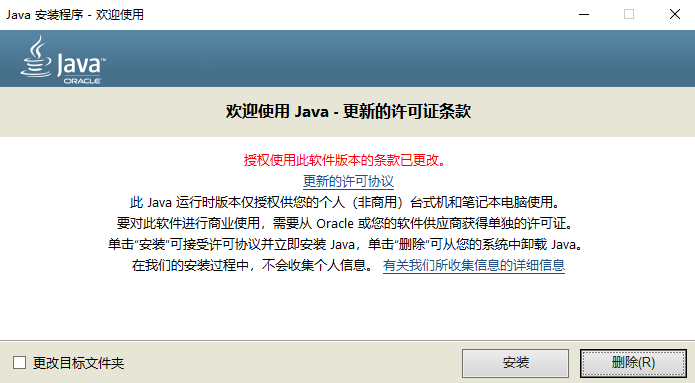

# 安装JAVA

要启动Minecraft，你需要确认自己的计算机已安装JAVA（默认64位）：

* [下载JAVA安装程序](https://javadl.oracle.com/webapps/download/AutoDL?BundleId=242990_a4634525489241b9a9e1aa73d9e118e6)
* 运行JAVA安装程序
* 点击“安装”


成功安装JAVA后，继续查阅子条目以了解如何启动游戏。


